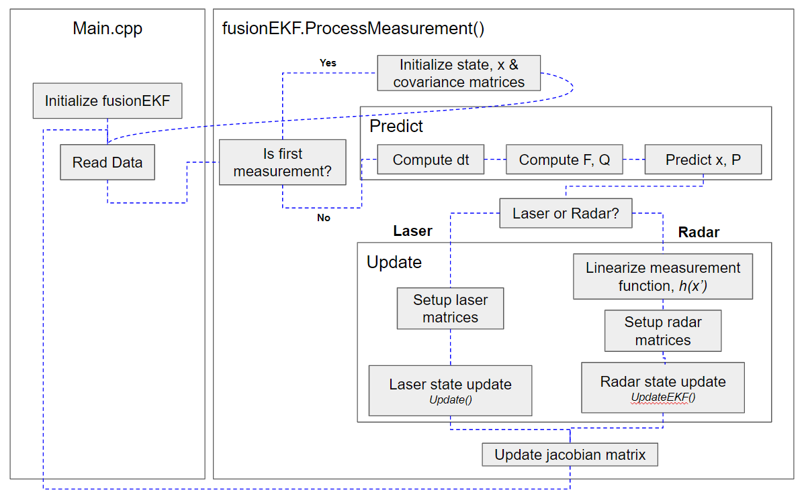

# Extended Kalman Filter Project

In this project, a kalman filter is used to estimate the state of a moving object of interest with noisy lidar and radar measurements. Passing the project requires obtaining RMSE values that are lower than the tolerance outlined in the project rubric. 

## Source Code
- main.cpp
    - Communicates with the Term 2 Simulator (see download link below) receiving data measurements, calls a function to run the Kalman filter, calls a function to calculate RMSE.
- FusionEKF.cpp
    - Initializes extended kalman filter and calls the predict, update function.
- kalman_filter.cpp
    - Defines the predict function, the update function for lidar, and the update function for radar.
- tools.cpp
    - Function to calculate RMSE and the Jacobian matrix.

## Extended Kalman Filter Flow


```CPP
/* Predict */
x_ = F_ * x_;
Ft = F_.transpose();
P_ = F_ * P_ * Ft + Q_;
```

```CPP
/* Laser Update */
z_pred = H_ * x_;
y = z - z_pred;
Ht = H_.transpose();
S = H_ * P_ * Ht + R_;
Si = S.inverse();
PHt = P_ * Ht;
K = PHt * Si;

x_ = x_ + (K * y);
x_size = x_.size();
I = Identity(x_size, x_size);
P_ = (I - K * H_) * P_;
```

```CPP
/* Radar Update */

// Convert cartesian to polar coordinates
mag_p = sqrt(pow(x_[0], 2) + pow(x_[1], 2));
phi = atan2(x_[1], x_[0]);
h_x << mag_p, phi, (x_[0]*x_[2]+x_[1]*x_[3])/mag_p;

y = z - h_x;
Ht = H_.transpose();
S = H_ * P_ * Ht + R_;
Si = S.inverse();
PHt = P_ * Ht;
K = PHt * Si;

x_ = x_ + (K * y);
x_size = x_.size();
I = Identity(x_size, x_size);
P_ = (I - K * H_) * P_;
```

## Dataset1 results


Final RMSE values for Dataset1:
- x: 0.0979
- y: 0.0845
- Vx: 0.4644
- Vy: 0.4047

## Dependencies (Udacity Term 2 Simulator, uWebSocket)

This project involves the Term 2 Simulator which can be downloaded [here](https://github.com/udacity/self-driving-car-sim/releases).

This repository requires setting up and installing [uWebSocketIO](https://github.com/uWebSockets/uWebSockets) for either Linux or Mac systems. For windows you can use either Docker, VMware, or even [Windows 10 Bash on Ubuntu](https://www.howtogeek.com/249966/how-to-install-and-use-the-linux-bash-shell-on-windows-10/) to install uWebSocketIO. Please see the uWebSocketIO Starter Guide page in the classroom within the EKF Project lesson for the required version and installation scripts.

The main program can be built and run by doing the following from the project top directory.

1. mkdir build
2. cd build
3. cmake ..
4. make
5. ./ExtendedKF

## Other Important Dependencies

* cmake >= 3.5
  * All OSes: [click here for installation instructions](https://cmake.org/install/)
* make >= 4.1 (Linux, Mac), 3.81 (Windows)
  * Linux: make is installed by default on most Linux distros
  * Mac: [install Xcode command line tools to get make](https://developer.apple.com/xcode/features/)
  * Windows: [Click here for installation instructions](http://gnuwin32.sourceforge.net/packages/make.htm)
* gcc/g++ >= 5.4
  * Linux: gcc / g++ is installed by default on most Linux distros
  * Mac: same deal as make - [install Xcode command line tools](https://developer.apple.com/xcode/features/)
  * Windows: recommend using [MinGW](http://www.mingw.org/)

## Basic Build Instructions

1. Clone this repo.
2. Make a build directory: `mkdir build && cd build`
3. Compile: `cmake .. && make` 
   * On windows, you may need to run: `cmake .. -G "Unix Makefiles" && make`
4. Run it: `./ExtendedKF `

